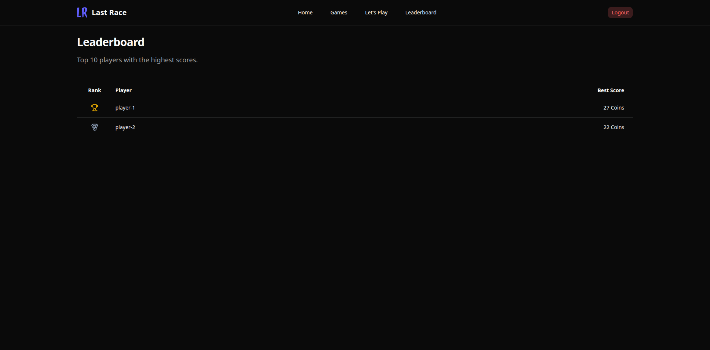
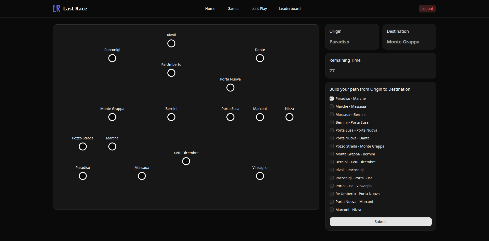

# Exam #1: "Last Race"
## Student: s356644 REZAEI ABDULLAH

## React Client Application Routes

- Route `/`: Instructions and rules of the game.
- Route `/auth/login`: User login.
- Route `/map`: Map display and start new game.
- Route `/games`: User's game history.
- Route `/games/:gameId`: Game and result display.
- Route `/leaderboard`: Leaderboard table.
- Route `*`: This route acts as a fallback and displays a 404 text if the route entered in the URL is not found.

## API Server

- POST `/api/auth/login`
  - request body:
  ```json
  {
    "username": "username",
    "password": "password"
  }
  ```
  - response body:
  ```json
  {
    "success": true,
    "data": {
        "id": 1,
        "username": "username"
    },
    "message": "Login successful"
  }
  ```
- POST `/api/auth/logout`
  - request body:
  ```json
  {}
  ```
  - response body:
  ```json
  {
    "success": true,
    "data": null,
    "message": "Logout successful"
  }
  ```
- GET `/api/auth/user`
  - request params:
  ```json
  {}
  ```
  - response body(authenticated user):
  ```json
  {
    "success": true,
    "data": {
        "id": 1,
        "username": "abrezaei"
    },
    "message": "Authenticated"
  }
  ```
  - response body(not authenticated user):
  ```json
  {
    "success": true,
    "data": null,
    "message": "Not Authenticated"
  }
  ```
- GET `/api/map`
  - request params:
  ```json
  {}
  ```
  - response body:
  ```json
  {
    "success": true,
    "data": {
        "lines": [
            {
                "id": 1,
                "name": "Po Line",
                "color": "#2B7FFF"
            },
            {
                "id": 2,
                "name": "Mole Line",
                "color": "#FB2C36"
            },
            {
                "id": 3,
                "name": "Valentino Line",
                "color": "#00C950"
            },
            {
                "id": 4,
                "name": "Alpina Line",
                "color": "#6A7282"
            }
        ],
        "stations": [
            {
                "id": 1,
                "name": "Paradiso",
                "x": 100,
                "y": 500
            },
            {
                "id": 2,
                "name": "Marche",
                "x": 200,
                "y": 400
            },
            {
                "id": 3,
                "name": "Massaua",
                "x": 300,
                "y": 500
            },
            {
                "id": 4,
                "name": "Pozzo Strada",
                "x": 100,
                "y": 400
            },
            {
                "id": 5,
                "name": "Monte Grappa",
                "x": 200,
                "y": 300
            },
            {
                "id": 6,
                "name": "Rivoli",
                "x": 400,
                "y": 50
            },
            {
                "id": 7,
                "name": "Racconigi",
                "x": 200,
                "y": 100
            },
            {
                "id": 8,
                "name": "Bernini",
                "x": 400,
                "y": 300
            },
            {
                "id": 9,
                "name": "XVIII Dicembre",
                "x": 450,
                "y": 450
            },
            {
                "id": 10,
                "name": "Porta Susa",
                "x": 600,
                "y": 300
            },
            {
                "id": 11,
                "name": "Vinzaglio",
                "x": 700,
                "y": 500
            },
            {
                "id": 12,
                "name": "Re Umberto",
                "x": 400,
                "y": 150
            },
            {
                "id": 13,
                "name": "Porta Nuova",
                "x": 600,
                "y": 200
            },
            {
                "id": 14,
                "name": "Marconi",
                "x": 700,
                "y": 300
            },
            {
                "id": 15,
                "name": "Nizza",
                "x": 800,
                "y": 300
            },
            {
                "id": 16,
                "name": "Dante",
                "x": 700,
                "y": 100
            }
        ],
        "segments": [
            {
                "id": 1,
                "origin": 1,
                "destination": 2,
                "line_id": 1
            },
            {
                "id": 2,
                "origin": 2,
                "destination": 3,
                "line_id": 1
            },
            {
                "id": 3,
                "origin": 3,
                "destination": 8,
                "line_id": 1
            },
            {
                "id": 4,
                "origin": 8,
                "destination": 10,
                "line_id": 1
            },
            {
                "id": 5,
                "origin": 10,
                "destination": 13,
                "line_id": 1
            },
            {
                "id": 6,
                "origin": 13,
                "destination": 16,
                "line_id": 1
            },
            {
                "id": 7,
                "origin": 4,
                "destination": 5,
                "line_id": 2
            },
            {
                "id": 8,
                "origin": 5,
                "destination": 8,
                "line_id": 2
            },
            {
                "id": 9,
                "origin": 8,
                "destination": 9,
                "line_id": 2
            },
            {
                "id": 10,
                "origin": 6,
                "destination": 7,
                "line_id": 3
            },
            {
                "id": 11,
                "origin": 7,
                "destination": 10,
                "line_id": 3
            },
            {
                "id": 12,
                "origin": 10,
                "destination": 11,
                "line_id": 3
            },
            {
                "id": 13,
                "origin": 12,
                "destination": 13,
                "line_id": 4
            },
            {
                "id": 14,
                "origin": 13,
                "destination": 14,
                "line_id": 4
            },
            {
                "id": 15,
                "origin": 14,
                "destination": 15,
                "line_id": 4
            }
        ]
    },
    "message": "Map retrieved"
  }
  ```
- GET `/api/games`
  - request params:
  ```json
  {}
  ```
  - response body:
  ```json
  {
    "success": true,
    "data": [
        {
            "id": 1,
            "user_id": 1,
            "origin": "Paradiso",
            "destination": "Dante",
            "score": 27,
            "started_at": 1781733600
        },
        {
            "id": 3,
            "user_id": 1,
            "origin": "Marconi",
            "destination": "Rivoli",
            "score": 0,
            "started_at": 1782129685
        }
    ],
    "message": "Games retrieved"
  }
  ```
- POST `/api/games/start`
  - request body:
  ```json
  {}
  ```
  - response body:
  ```json
  {
    "success": true,
    "data": {
        "id": 1,
        "origin": 15,
        "destination": 10,
        "started_at": 1782133773
    },
    "message": "Game started"
  }
  ```
- GET `/api/games/:id`
  - request params:
  ```json
  {
    "id": 1
  }
  ```
  - response body:
  ```json
  {
    "success": true,
    "data": {
        "id": 1,
        "user_id": 1,
        "origin": 1,
        "destination": 16,
        "score": 27,
        "started_at": 1781733600,
        "history": [
            {
                "step": 1,
                "type": "event",
                "description": "Found a coin",
                "segment_id": 1,
                "event_id": 5,
                "effect": 1,
                "score_before": 20,
                "score_after": 21,
                "user_origin": 1,
                "user_destination": 2
            },
            {
                "step": 2,
                "type": "event",
                "description": "Perfect timing",
                "segment_id": 2,
                "event_id": 6,
                "effect": 2,
                "score_before": 21,
                "score_after": 23,
                "user_origin": 2,
                "user_destination": 3
            },
            {
                "step": 3,
                "type": "event",
                "description": "Won metro lottery",
                "segment_id": 3,
                "event_id": 8,
                "effect": 4,
                "score_before": 23,
                "score_after": 27,
                "user_origin": 3,
                "user_destination": 8
            },
            {
                "step": 4,
                "type": "event",
                "description": "Dropped a coin",
                "segment_id": 4,
                "event_id": 4,
                "effect": -1,
                "score_before": 27,
                "score_after": 26,
                "user_origin": 8,
                "user_destination": 10
            },
            {
                "step": 5,
                "type": "event",
                "description": "Kind passenger",
                "segment_id": 5,
                "event_id": 7,
                "effect": 3,
                "score_before": 26,
                "score_after": 29,
                "user_origin": 10,
                "user_destination": 13
            },
            {
                "step": 6,
                "type": "event",
                "description": "Train delayed",
                "segment_id": 6,
                "event_id": 3,
                "effect": -2,
                "score_before": 29,
                "score_after": 27,
                "user_origin": 13,
                "user_destination": 16
            }
        ]
    },
    "message": "Game retrieved"
  }
  ```
- POST `/api/games/:id/submit`
  - request params:
  ```json
  {
    "id": 1
  }
  ```
  - request body:
  ```json
  {
    "route": [1, 2, 3, 4, 5]
  }
  ```
  - response body:
  ```json
  {
    "success": true,
    "data": {
        "id": 1,
        "user_id": 1,
        "origin": 10,
        "destination": 4,
        "score": 25,
        "started_at": 1782133983,
        "history": [
            {
                "step": 1,
                "type": "event",
                "description": "Found a coin",
                "segment_id": 4,
                "event_id": 5,
                "effect": 1,
                "score_before": 20,
                "score_after": 21,
                "user_origin": 10,
                "user_destination": 8
            },
            {
                "step": 2,
                "type": "event",
                "description": "Found a coin",
                "segment_id": 8,
                "event_id": 5,
                "effect": 1,
                "score_before": 21,
                "score_after": 22,
                "user_origin": 8,
                "user_destination": 5
            },
            {
                "step": 3,
                "type": "event",
                "description": "Kind passenger",
                "segment_id": 7,
                "event_id": 7,
                "effect": 3,
                "score_before": 22,
                "score_after": 25,
                "user_origin": 5,
                "user_destination": 4
            }
        ]
    },
    "message": "Game processed"
  }
  ```
- GET `/api/lines`
  - request params:
  ```json
  {}
  ```
  - response body:
  ```json
  {
    "success": true,
    "data": [
        {
            "id": 1,
            "name": "Po Line",
            "color": "#2B7FFF"
        },
        {
            "id": 2,
            "name": "Mole Line",
            "color": "#FB2C36"
        },
        {
            "id": 3,
            "name": "Valentino Line",
            "color": "#00C950"
        },
        {
            "id": 4,
            "name": "Alpina Line",
            "color": "#6A7282"
        }
    ],
    "message": "Lines retrieved"
  }
  ```
- GET `/api/segments`
  - request params:
  ```json
  {}
  ```
  - response body:
  ```json
  {
    "success": true,
    "data": [
        {
            "id": 1,
            "origin": 1,
            "destination": 2,
            "line_id": 1
        },
        {
            "id": 2,
            "origin": 2,
            "destination": 3,
            "line_id": 1
        },
        {
            "id": 3,
            "origin": 3,
            "destination": 8,
            "line_id": 1
        },
        {
            "id": 4,
            "origin": 8,
            "destination": 10,
            "line_id": 1
        },
        {
            "id": 5,
            "origin": 10,
            "destination": 13,
            "line_id": 1
        },
        {
            "id": 6,
            "origin": 13,
            "destination": 16,
            "line_id": 1
        },
        {
            "id": 7,
            "origin": 4,
            "destination": 5,
            "line_id": 2
        },
        {
            "id": 8,
            "origin": 5,
            "destination": 8,
            "line_id": 2
        },
        {
            "id": 9,
            "origin": 8,
            "destination": 9,
            "line_id": 2
        },
        {
            "id": 10,
            "origin": 6,
            "destination": 7,
            "line_id": 3
        },
        {
            "id": 11,
            "origin": 7,
            "destination": 10,
            "line_id": 3
        },
        {
            "id": 12,
            "origin": 10,
            "destination": 11,
            "line_id": 3
        },
        {
            "id": 13,
            "origin": 12,
            "destination": 13,
            "line_id": 4
        },
        {
            "id": 14,
            "origin": 13,
            "destination": 14,
            "line_id": 4
        },
        {
            "id": 15,
            "origin": 14,
            "destination": 15,
            "line_id": 4
        }
    ],
    "message": "Segments retrieved"
  }
  ```
- GET `/api/stations`
  - request params:
  ```json
  {}
  ```
  - response body:
  ```json
  {
    "success": true,
    "data": [
        {
            "id": 1,
            "name": "Paradiso",
            "x": 100,
            "y": 500
        },
        {
            "id": 2,
            "name": "Marche",
            "x": 200,
            "y": 400
        },
        {
            "id": 3,
            "name": "Massaua",
            "x": 300,
            "y": 500
        },
        {
            "id": 4,
            "name": "Pozzo Strada",
            "x": 100,
            "y": 400
        },
        {
            "id": 5,
            "name": "Monte Grappa",
            "x": 200,
            "y": 300
        },
        {
            "id": 6,
            "name": "Rivoli",
            "x": 400,
            "y": 50
        },
        {
            "id": 7,
            "name": "Racconigi",
            "x": 200,
            "y": 100
        },
        {
            "id": 8,
            "name": "Bernini",
            "x": 400,
            "y": 300
        },
        {
            "id": 9,
            "name": "XVIII Dicembre",
            "x": 450,
            "y": 450
        },
        {
            "id": 10,
            "name": "Porta Susa",
            "x": 600,
            "y": 300
        },
        {
            "id": 11,
            "name": "Vinzaglio",
            "x": 700,
            "y": 500
        },
        {
            "id": 12,
            "name": "Re Umberto",
            "x": 400,
            "y": 150
        },
        {
            "id": 13,
            "name": "Porta Nuova",
            "x": 600,
            "y": 200
        },
        {
            "id": 14,
            "name": "Marconi",
            "x": 700,
            "y": 300
        },
        {
            "id": 15,
            "name": "Nizza",
            "x": 800,
            "y": 300
        },
        {
            "id": 16,
            "name": "Dante",
            "x": 700,
            "y": 100
        }
    ],
    "message": "Stations retrieved"
  }
  ```
- GET `/api/leaderboard`
  - request params:
  ```json
  {}
  ```
  - response body:
  ```json
  {
    "success": true,
    "data": [
        {
            "username": "abrezaei",
            "best_score": 27
        },
        {
            "username": "username",
            "best_score": 22
        }
    ],
    "message": "Leaderboard retrieved"
  }
  ```

## Database Tables

- Table `users` - contains: `id, username, hashed_password, salt`
- Table `lines` - contains: `id, name, color`
- Table `stations` - contains: `id, name, x, y`
- Table `segments` - contains: `id, origin, destination, line_id`
- Table `events` - contains: `id, description, effect`
- Table `games` - contains: `id, user_id, origin, destination, score, started_at, history`

## Main React Components

- `Map` (in `components/map.jsx`): Displays the map with different states(showing segments for the start game page and without segments for the game page).

## Screenshot




## Users Credentials

- username: `player-1`, password: `strong_password`
- username: `player-2`, password: `strong_password`
- username: `player-3`, password: `strong_password`

## Use of AI Tools
During the development of this project, AI tools were utilized primarily for technology transition and complex logic debugging:
- Coming from a background of building large-scale, scalable architectures in Vue.js, this was my first experience with React. I used AI to map advanced Vue concepts, reactivity patterns, and architectural tricks to their exact React equivalents. This ensured the project maintained a clean and robust structure.
- AI assisted in the implementation, step-by-step tracing, and debugging of the complex route-validation algorithm.
